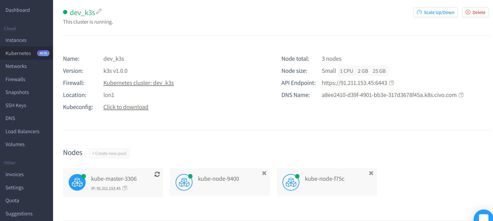
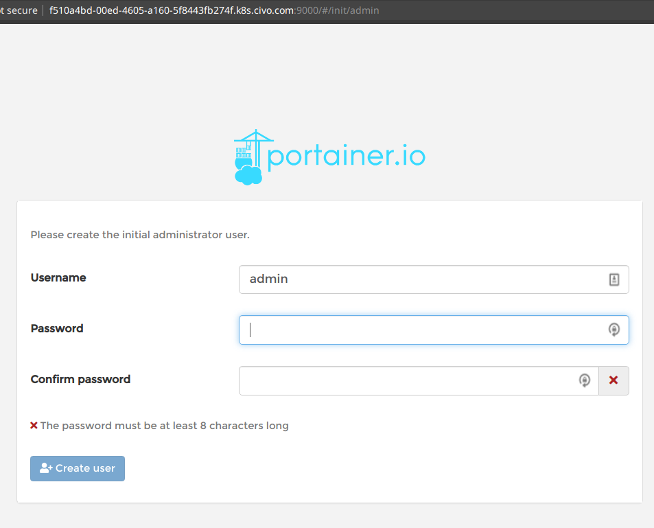
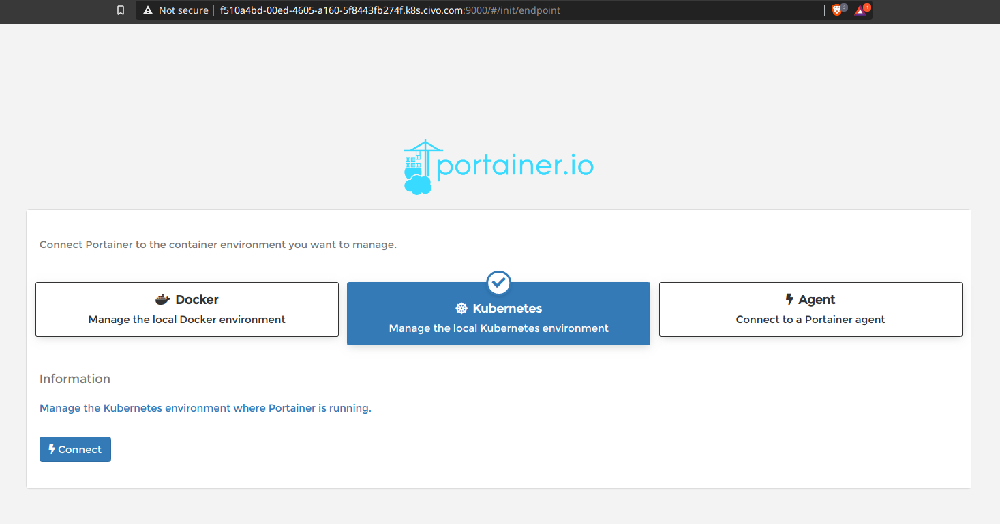
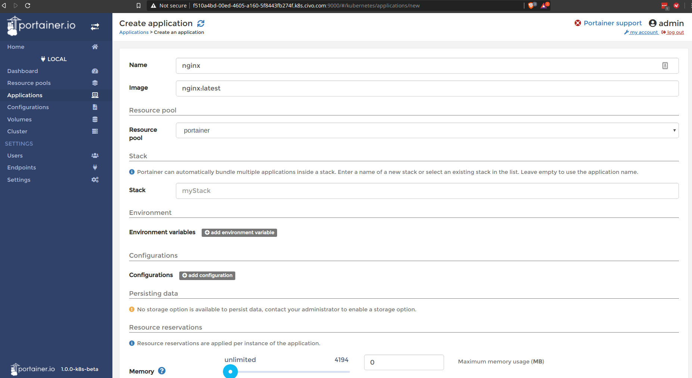
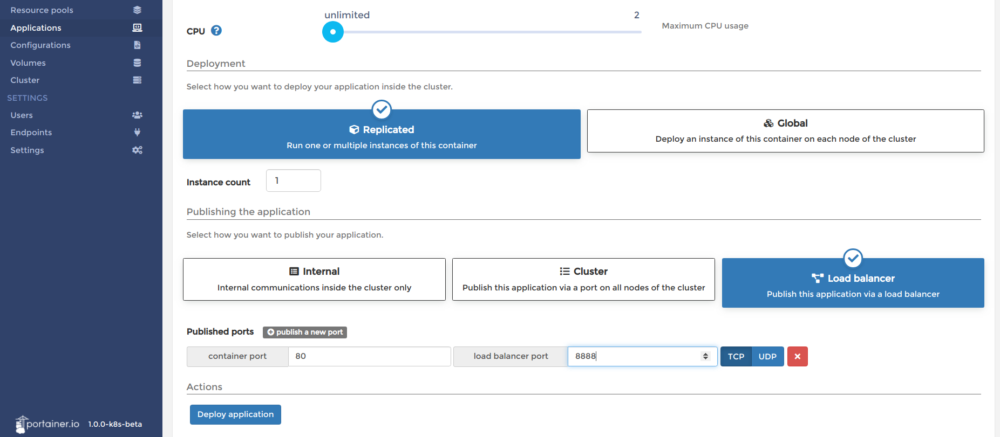
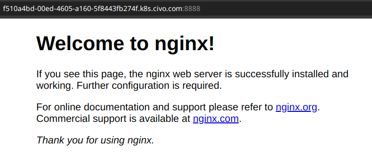

# civo-portainer-k3s
Example of running [portainer-k8s](https://github.com/portainer/portainer-k8s)
on [civo-k3s](https://www.civo.com/) using pure terraform

Prerequisites
* [Terraform > 0.12](https://www.terraform.io/downloads.html)
* [Civo Cloud account](https://www.civo.com/account)
* [Civo Terraform Provider](https://github.com/civo/terraform-provider-civo)

Steps:
1. Clone repo: `git clone git@github.com:jhole89/terraform-k8s-example.git`
2. Change to this directory: `cd civo-portainer-k3s`
3. Initialise terraform: `terraform init`
4. Copy tfvars template: `cp terraform.tfvars.template terraform.tfvars`
5. Fill in `terraform.tfvars` with your Civo API key (found at `https://www.civo.com/account/security`)
6. Apply terraform plan: `terraform apply --auto-approve` - you should see the following output
    ```
    module.cluster.civo_kubernetes_cluster.k3s: Creating...
    ...
    ...
    ...
    Apply complete! Resources: 6 added, 0 changed, 0 destroyed.
    ```
7. Log into your Civo account and grab the dns name:

   

   Portainer will be published on port 9000:
   

   Create the admin user and connect to the civo kubernetes cluster:
   

   You can now use portainer to deploy kubernetes applications into civo-k3s:
   

   

   

8. Once no longer required you can remove all resources: `terraform destroy --auto-approve`
